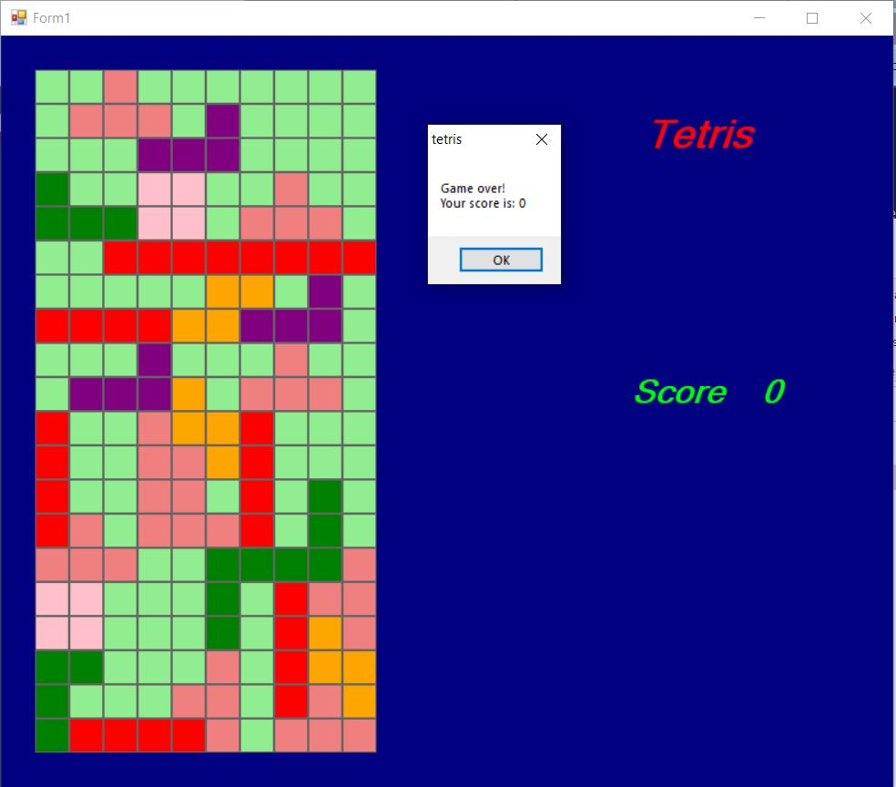

# Tetris

by Bardia Parmoun

## DESCRIPTION
- This repository simulates the game of tetris

## USAGE
- First locate and open the tetris.exe file
- You can use the up arrow key &#8593; to rotate the pieces.
- You can use the right and left arrow keys &#8592;&#8594; to move the pieces right and left.
- You can use the down key &#8595; to speed up the pieces. 
## Examples

- Here is an example of using the program:

## CREDITS
Author: Bardia Parmoun

Copyright © 2021 Bardia Parmoun. All rights reserved
